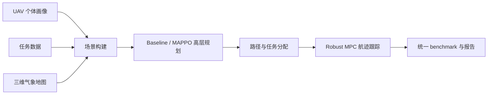

# 大创答辩 PPT 提纲

本文档用于制作最终答辩 PPT。建议控制在 12-14 页，主线突出“MARL 高层规划 + Robust MPC 底层管控 + 可跟踪性优化”。

## 第 1 页：题目页

标题：

```text
基于 MARL 与 Robust MPC 的无人机联合路径规划与管控平台
```

副标题：

```text
结合三维气象地图与无人机个体画像的任务分配、路径规划和航迹跟踪
```

展示要点：

1. 项目名称。
2. 成员与指导老师。
3. 学校/学院/日期。

## 第 2 页：研究背景

讲述重点：

1. 多 UAV 作业需要同时考虑任务需求、气象风险和无人机能力差异。
2. 传统离线路径规划面对突变环境响应滞后。
3. 只规划路径还不够，还要判断路径是否能被底层控制器稳定跟踪。

建议配图：

```text
三维气象地图 + UAV + 任务点示意图
```

可用素材：

```text
outputs/default_scenario/weather_layer.png
outputs/default_scenario/routes_weather_grid.png
```

## 第 3 页：问题定义

核心问题：

```text
给定 UAV 个体画像、任务集合和三维气象地图，
如何联合完成任务分配、路径规划和底层航迹跟踪？
```

约束：

1. UAV 载荷、健康状态、风险等级。
2. 任务位置、优先级、载荷需求。
3. 气象代价、风场扰动。
4. MPC 跟踪误差、速度/高度/加速度约束。

## 第 4 页：总体架构

建议画架构图：



讲述重点：

1. 数据层、算法层、控制层、评估层已经形成闭环。
2. MAPPO 负责高层决策，Robust MPC 负责底层执行验证。

## 第 5 页：数据与个体画像

展示内容：

| 数据 | 文件 | 作用 |
| --- | --- | --- |
| UAV 画像 | `data/uav_profiles/` | 能力、健康、风险 |
| 任务 | `data/tasks/demo_tasks.csv` | 任务点、载荷、优先级 |
| 气象地图 | `data/weather_cost_map/` | 时间、高度、气象代价 |

说明：

1. 当前使用 MAMBA-Lite / Torch MAMBA 画像。
2. 后续可以替换成正式 MAMBA 输出。

## 第 6 页：Baseline 与 MAPPO 设计

baseline：

1. `one_shot`
2. `sequential`
3. `weather_grid`
4. `marl_greedy`

MAPPO 动作空间：

1. 选择任务。
2. 选择高度。
3. 选择路径策略：`direct`、`weather_grid`、`weather_3d`。

讲述重点：

```text
MAPPO 不只是分配任务，还能学习选择不同路径生成方式。
```

## 第 7 页：Reward 设计与数值稳定

基础 reward：

```text
任务完成奖励
- 距离惩罚
- 气象惩罚
- 能耗惩罚
- 风险惩罚
- path-cost 惩罚
```

已解决的问题：

1. 早期 value loss 达到 10000 以上。
2. 引入 `reward_scale` 和 `value_target_normalization`。
3. 加入归一化 path-cost reward。

对应报告：

```text
PATH_COST_REWARD_REPORT.md
```

## 第 8 页：Robust MPC 闭环评估

讲述重点：

1. 高层规划结果会被送入 Robust MPC。
2. 评价路径是否真正容易跟踪。

指标：

| 指标 | 含义 |
| --- | --- |
| `mpc_mean_tracking_error` | 平均跟踪误差 |
| `mpc_max_tracking_error` | 最大跟踪误差 |
| `mpc_total_control_effort` | 控制能耗 |
| `mpc_constraint_violation_count` | 约束违反次数 |

可展示文件：

```text
outputs/mappo_pathcost_benchmark_final/mpc_tracking.csv
```

## 第 9 页：path-cost MAPPO 结果

核心表：

| 方法 | 完成任务数 | 总路径代价 | 总奖励 |
| --- | ---: | ---: | ---: |
| sequential | 5 | 5848.3320 | 0 |
| weather_grid | 5 | 5463.6228 | 0 |
| marl_greedy | 5 | 7907.5821 | 431.4538 |
| path-cost MAPPO | 5 | 6738.1788 | 425.3553 |

讲述结论：

1. MAPPO 完成全部任务。
2. MAPPO 优于 `marl_greedy`。
3. `weather_grid` 仍是路径代价最强 baseline。

## 第 10 页：可跟踪性问题

问题：

```text
path-cost MAPPO 仍会产生部分长 direct 航段，
这些航段路径代价可能可接受，但 MPC 跟踪误差很大。
```

旧 MAPPO 指标：

| 指标 | 数值 |
| --- | ---: |
| `direct_action_count` | 1 |
| `mpc_mean_tracking_error` | 69.3290 |
| `mpc_max_tracking_error` | 2731.1681 |
| `mpc_constraint_violation_count` | 21 |

## 第 11 页：Trackability Reward 优化

新增代理指标：

```text
max_segment_distance_km
```

新增 reward：

```text
trackability_penalty = trackability_weight * normalized(max_segment_distance_km)
```

直观解释：

1. direct 航段 waypoint 少，单段距离长。
2. weather-grid / weather-3D waypoint 多，更容易跟踪。
3. 惩罚超长航段，可以让 MAPPO 更偏向 MPC 友好的路径。

## 第 12 页：优化后结果

| 指标 | path-cost MAPPO | trackability MAPPO |
| --- | ---: | ---: |
| 完成任务数 | 5 | 5 |
| direct 动作数 | 1 | 0 |
| weather-grid 动作数 | 0 | 2 |
| weather-3D 动作数 | 4 | 3 |
| MPC 平均跟踪误差 | 69.3290 | 0.1204 |
| MPC 最大跟踪误差 | 2731.1681 | 5.3404 |
| MPC 约束违反次数 | 21 | 0 |

讲述结论：

```text
trackability reward 显著提升了底层控制可执行性。
```

## 第 13 页：多 seed 稳健性实验

配置：

```text
configs/mappo_trackability_multiseed.yaml
```

结果：

| 实验 | seed | episode | 完成任务数 | MPC 约束违反 |
| --- | ---: | ---: | ---: | ---: |
| seed7 | 7 | 40 | 5 | 0 |
| seed11 | 11 | 40 | 5 | 待进一步 benchmark |
| seed17 | 17 | 40 | 5 | 待进一步 benchmark |

当前多 seed 最优：

```text
outputs/mappo_trackability_multiseed/track_w25_seed7_e40/best_checkpoint.pt
```

对应 benchmark：

```text
mpc_mean_tracking_error = 0.1533
mpc_constraint_violation_count = 0
```

## 第 14 页：结论与展望

结论：

1. 完成了 UAV 个体画像、三维气象地图、任务数据的统一接入。
2. 完成了 baseline、MARL greedy、MAPPO 的统一对比。
3. 完成了 Robust MPC 底层跟踪评估。
4. 通过 trackability reward，使 MAPPO 路径更适合 MPC 跟踪。
5. 项目形成了可运行、可复现、可展示的联合规划与管控原型。

展望：

1. 扩大多 seed、多场景训练。
2. 替换正式 MAMBA 个体画像。
3. 引入 imitation learning 学习 weather-grid 专家策略。
4. 将真实 MPC tracking error 进一步纳入训练目标。

## 答辩一句话总结

```text
我们的工作不是只做路径规划，而是把“无人机能不能稳定执行这条路径”
也纳入了 MARL 的评价与优化，形成了气象地图、个体画像、任务分配、
路径规划和 Robust MPC 控制跟踪的完整闭环。
```

## 可能被问到的问题

### Q1：为什么 MAPPO 没有超过 weather_grid？

回答：

```text
weather_grid 是强专家基线，直接使用气象网格搜索，天然适合当前小规模默认场景。
MAPPO 当前训练规模有限，但它的优势是可扩展到多目标权衡，例如任务分配、
气象风险、个体能力和 MPC 可跟踪性联合优化。
```

### Q2：trackability reward 为什么有效？

回答：

```text
它惩罚相邻 waypoint 间距过大的路径，减少长 direct 航段。
这会让 MAPPO 更倾向于 weather-grid / weather-3D 路径，
从而显著降低 MPC 跟踪误差和约束违反次数。
```

### Q3：项目目前是否已经完成？

回答：

```text
作为大创可运行原型和答辩展示系统，已经完成。
后续如果要继续提升论文质量，可以扩大训练规模、替换正式 MAMBA、
并引入 imitation learning 或更真实的 MPC-in-the-loop 训练。
```
